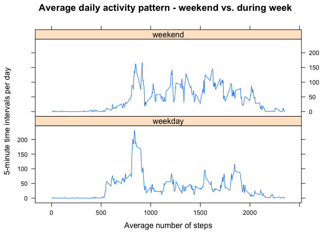

# Reproducible Research: Peer Assessment 1
Reproducible Research: Peer Assessment 1
-----------------------------------------------------------

 
This report is based on an assignment for the course 'Reproducible Resarch', part of the [Data Science Specialization](https://www.coursera.org/specializations/jhu-data-science) course by John Hopkins University on Coursera.

[Here](https://github.com/rdpeng/RepData_PeerAssessment1) is a link to the assignment on github.

 
**Information about the data we know before it's loaded into R:**

For this assignment we'll work with data (number of steps) recorded from a personal activity monitoring device. The number of steps was recorded at 5-minute intervals throughout each day, over 2 months (61 days).

Dataset: Activity monitoring data
The dataset is stored in a comma-separated-value (CSV) file and there are a total of 17,568 observations in this dataset.

The variables included in the dataset are:
**steps**: Number of steps taking in a 5-minute interval (missing values are coded as NA)
**date**: The date on which the measurement was taken in YYYY-MM-DD format
**interval**: Identifier for the 5-minute interval in which measurement was taken


Assignment steps
-----------

## Loading and preprocessing the data

**Loading the data**  
As a first step, the data is downloaded - if the file does not exists in the working directory - and the zipped package unzipped.


```r
if (!file.exists('repdata%2Fdata%2Factivity.zip')) {
    download.file("https://d396qusza40orc.cloudfront.net/repdata%2Fdata%2Factivity.zip", destfile = "repdata%2Fdata%2Factivity.zip")
    DateDownloaded <- date()
    } 
unzip("repdata%2Fdata%2Factivity.zip")
```

Next, data ('activity.csv') into R. We know from the instructions that missing values were indicated as 'NA'.
Also, the date variable is saved as character value. Because I intend to convert the date observations (from character strings) into a date format, I overwrite the default option to convert character variabls into factor variables.


```r
activity <- read.csv('activity.csv', na.strings = "NA", stringsAsFactors = FALSE)
```
  
A quick look at the data to confirm the dimensions (there should be 17,568 observations), and the class of each variable.

```r
str(activity)
```

```
## 'data.frame':	17568 obs. of  3 variables:
##  $ steps   : int  NA NA NA NA NA NA NA NA NA NA ...
##  $ date    : chr  "2012-10-01" "2012-10-01" "2012-10-01" "2012-10-01" ...
##  $ interval: int  0 5 10 15 20 25 30 35 40 45 ...
```

```r
head(activity)
```

```
##   steps       date interval
## 1    NA 2012-10-01        0
## 2    NA 2012-10-01        5
## 3    NA 2012-10-01       10
## 4    NA 2012-10-01       15
## 5    NA 2012-10-01       20
## 6    NA 2012-10-01       25
```


**Preprocessing**  
First I choose to convert the date variable, from character into date format.

```r
activity$date <- as.Date(activity$date, "%Y-%m-%d")
```

Second I want to create an additional vector that shows both date and time for each day. This requires to reformat the time intervals to times, and finally convert the character vector into date and time format.

```r
time <- formatC(activity$interval, width = 4, flag = '0')
datetime <- paste(activity$date, time, sep = " ")
datetime <- strptime(datetime, "%Y-%m-%d %H%M")
```


  
## What is mean total number of steps taken per day?
  
First we calculate the total number of steps taken per day.

```r
steps_per_day <- aggregate(steps ~ date, data = na.omit(activity), FUN = sum)
```
  
Then we plot a histogram of the total number of steps taken each day.

```r
with(steps_per_day, hist(steps, main = 'Total number of steps per day', xlab = "Number of steps"))
```

-1.png)<!-- -->

Then we calculate and report the mean and median of the total number of steps taken per day.

```r
mean_steps <- mean(steps_per_day$steps)
median_steps <- median(steps_per_day$steps)
```

The mean total number of steps per day is **1.0766189\times 10^{4}**.  
The median number of steps per day is **10765**.


## What is the average daily activity pattern?

Here, we're asked to plot the daily acitivity pattern - the average number of steps taken per 5-minute interval, averaged across all days in the data set, and to see when the most steps occured on average during this daily pattern.

Let's first see at what time the most steps were taken on averge during the day.


```r
interval_mean <- aggregate(steps ~ interval, activity, mean)
interval_mean_max <- subset(interval_mean, steps == max(steps))
interval_mean_max
```

```
##     interval    steps
## 104      835 206.1698
```

**As we can see the time 5-minute interval with the most steps on average (206.1698113) across all days is between 8:35 - 8:40 AM.**  
  
 
  Now let's plot the daily activity pattern.

```r
# convert interval integer to time format
time <- formatC(interval_mean$interval, flag = "0", width = "4")
time <- strptime(time, "%H%M")
#make the plot
plot(time, interval_mean$steps, type = "l", xlab = "Time (5-minute intervals)", ylab = "Average number of steps", main = "Average daily activity pattern")
```

-1.png)<!-- -->


  
## Imputing missing values

There are a number of days/intervals where there are missing values (coded as 𝙽𝙰). The presence of missing days may introduce bias into some calculations or summaries of the data.

Let's calculate the total number of missing values in the dataset (i.e. the total number of rows with NAs).


```r
sum(!complete.cases(activity))
```

```
## [1] 2304
```
There are `sum(!complete.cases(activity))` missing measurements, that's `mean(!complete.cases(activity))` percent of the data.

I am also curious to see if these missing values occur on specific dates or times.
After some analysis it becomes clear, that the missing data correspond to 8 days where no data was recorded throughout the whole day.

```r
missing <- activity[!complete.cases(activity),]
tapply(missing$steps, missing$date, length)
```

```
## 2012-10-01 2012-10-08 2012-11-01 2012-11-04 2012-11-09 2012-11-10 
##        288        288        288        288        288        288 
## 2012-11-14 2012-11-30 
##        288        288
```

I decide to fill the missing values with the average number of steps per 5-minute interval (across all days measured).

```r
activity_NAfill <- activity
activity_NAfill$steps[is.na(activity_NAfill$steps)] <- interval_mean$steps
```

Then we compare the total number of steps per day, the median and mean steps per day after filling in missing values, to what was calculated in the previous steps.


```r
per_Day_NAfill <- aggregate(steps ~ date, data = activity_NAfill, FUN = sum)
```

```r
with(per_Day_NAfill, hist(steps, main = 'Total number of steps per day', xlab = "Number of steps"))
```

-1.png)<!-- -->


```r
mean_nafill <- mean(per_Day_NAfill$steps)
median_nafill <- median(per_Day_NAfill$steps)
```

The __mean__ total number of steps per day, after replacing NA values with the average by 5-minute interval, is **1.0766189\times 10^{4}**, compared to **1.0766189\times 10^{4}** before filling in NA values.  
The __median__ number of steps per day, after replacing NA values with the average by 5-minute interval, is **1.0766189\times 10^{4}**, compared to **10765** before filling in NA values.

## Asre there differences in activity patterns between weekdays and weekends?

First we're adding a factor variable indicating whether a certain day was a weekend or weekday.

```r
library(plyr)
activity_NAfill$weekday <- weekdays(activity_NAfill$date, TRUE)
activity_NAfill$weekday <- revalue(activity_NAfill$weekday, c(Sat = "weekend", Sun = "weekend"))
activity_NAfill$weekday <- revalue(activity_NAfill$weekday, c(Mon= "weekday", Tue = "weekday", Wed = "weekday", Thu = "weekday", Fri = "weekday"))
activity_NAfill$weekday <- as.factor(activity_NAfill$weekday)
```

Now we're comparing the average number of steps per 5-min interval, averaged across all weekend days and weekday days by plotting them.

```r
mean_weekdays <- aggregate(steps ~ interval + weekday, activity_NAfill, mean)
```


```r
library('lattice')
xyplot(steps ~ interval | weekday, data = mean_weekdays, type = "l", layout = c(1,2), xlab = "Average number of steps", ylab = "5-minute time intervals per day", main = "Average daily activity pattern - weekend vs. during week")
```

<!-- -->
